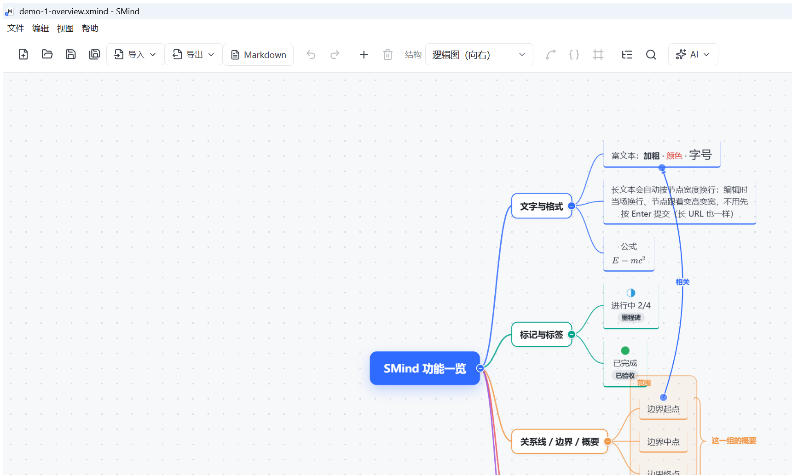
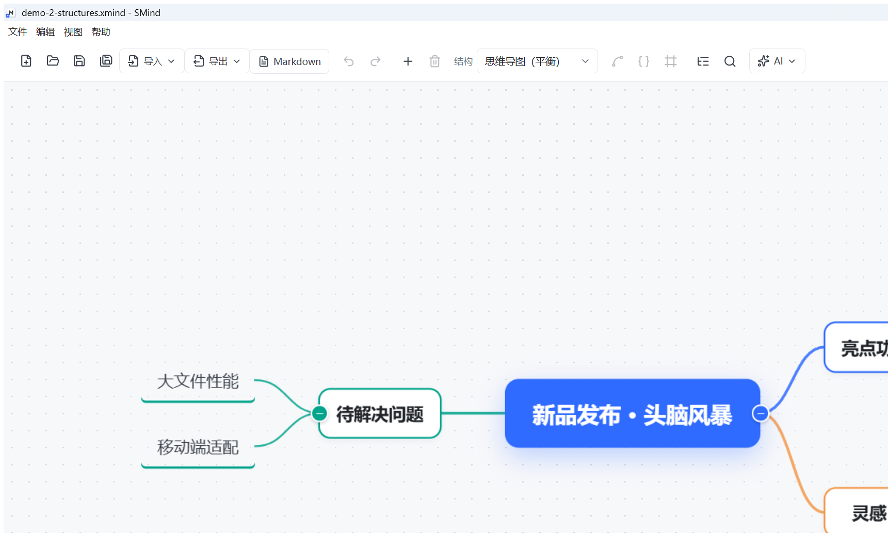
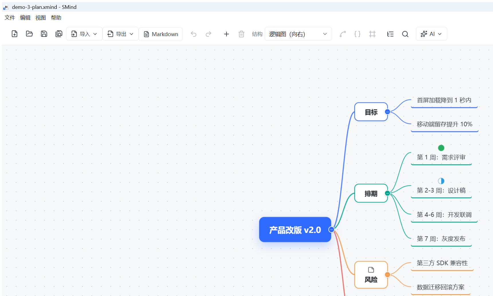
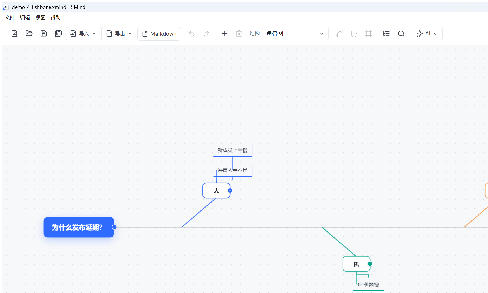

# SMind · 使用手册

> 一个**本地**思维导图软件，原生文件格式就是 `.xmind`，可直接与 Xmind 互通。
> 无账号、无服务器：**除了你主动点 AI，全程离线**。

## 界面预览









> 这四张图的源文件在 [`examples/`](./examples) 目录里，用 SMind 直接打开就能玩。

---

## 目录

- [一、安装与启动](#一安装与启动)
- [二、界面速览](#二界面速览)
- [三、五分钟上手](#三五分钟上手)
- [四、编辑主题](#四编辑主题)
- [五、拖拽：把主题搬到别处](#五拖拽把主题搬到别处)
- [六、大纲模式](#六大纲模式)
- [七、搜索 · 筛选 · 统计](#七搜索--筛选--统计)
- [八、主题外观与多画布](#八主题外观与多画布)
- [九、节点附加元素](#九节点附加元素)
- [十、导入与导出](#十导入与导出)
- [十一、AI 功能](#十一ai-功能)
- [十二、自动保存 · 崩溃恢复 · 历史与版本](#十二自动保存--崩溃恢复--历史与版本)
- [十三、常见问题](#十三常见问题)
- [十四、已知限制](#十四已知限制)
- [十五、给开发者](#十五给开发者)
- [十六、许可与声明](#十六许可与声明)

---

## 一、安装与启动

| 方式 | 怎么做 | 适合谁 |
|---|---|---|
| **免安装版**（推荐） | 双击 `SMind-<版本>-x64-portable.exe` 即用 | 自己用、发给别人 |
| **安装版** | 双击 `SMind-<版本>-x64-setup.exe`，可选安装目录，自动建桌面/开始菜单快捷方式 | 长期固定在一台机器上用 |
| 开发模式 | `npm install` 然后 `npm run dev` | 改代码的人 |

**运行要求**：Windows 10 / 11，64 位。

**首次运行会看到「Windows 已保护你的电脑 / 未知发布者」**——本软件没有代码签名，点「**更多信息**」→「**仍要运行**」即可；杀毒软件偶尔误报也是同一原因，加为信任即可。

**你的数据存在哪**（都在 `%APPDATA%\SMind`，不在 exe 旁边）：

- 主题配色、最近打开、版本快照、自动存档、AI 配置（含 API Key）
- 你保存的 `.xmind` 文件默认落在「**文档 / 思维导图**」目录，之后「另存为」会记住上次的位置

> 同时只能开一个窗口：再双击一次会因为"已有实例"直接退出，看起来像没反应。

**发送给别人前**，请把 [`docs/distribution.md`](docs/distribution.md) 里那段话一起发过去。

---

## 二、界面速览

```
┌──────────────────────────────────────────────────────────────┐
│ 工具栏：新建 打开 保存 另存为 导入▾ 导出▾ │ 撤销 重做 │ 加子主题 删除 │        │
│         结构▾ │ 关系线 概要 边界 │ 大纲 搜索 │ AI▾ …… 缩放组 │ 更多▾ │   │
├────────┬──────────────────────────────────────────┬──────────┤
│  大纲   │                                          │  节点属性  │
│  面板   │                 画 布                     │  主题外观  │
│（可选） │                                          │  搜索面板  │
├────────┴──────────────────────────────────────────┴──────────┤
│ 画布标签栏（多画布）          状态栏：文件名 ● 未保存 主题数 字数 缩放 │
└──────────────────────────────────────────────────────────────┘
```

- **工具栏**：所有常用动作都在这里；窗口变窄会自动换行，不会藏按钮。
- **画布**：无限大，可平移缩放；主题用 DOM 渲染（所以文字、图片、公式都很清晰），连线用 SVG。
- **右侧面板**：一次只开一个（节点属性 / 主题外观 / 搜索）。
- **底部图例**：拖拽时会点亮"这一下会发生什么"。

---

## 三、五分钟上手

1. **新建**：`Ctrl+N`（默认结构是**逻辑图（向右）**）。
2. **改中心主题**：双击它 → 输入 → `Enter`（提交并退出编辑）。
3. **接着建**：选中一个主题，`Enter` 建同级、`Tab` 建子级；新主题会立刻进入编辑，打完字按 `Enter` 结束（想继续建，再按一次 `Enter`）。
4. **换个样子**：工具栏「结构▾」换布局（选中**中心主题**＝整张画布换；选中**某个分支**＝只换那一条分支的排布）；「更多▾ → 主题外观」换配色。
5. **存起来**：`Ctrl+S` 存成 `.xmind`。

> 编辑中 `Enter` **只提交退出**；`Tab` 才是"提交并新建子主题"。想接着建同级，再按一次 `Enter`。

---

## 四、编辑主题

### 4.1 快捷键

**没在编辑文字时**

| 按键 | 作用 |
|---|---|
| `Tab` | 为当前主题添加**子主题** |
| `Enter` | 添加**同级**主题 |
| `双击` / `F2` | 编辑文本 |
| **直接打字** | 选中主题后按任意字符＝**进入编辑并接着输入**（按空格只进入编辑，不落字） |
| `Delete` / `Backspace` | 删除所选主题（连同子树） |
| `方向键` | 在主题之间移动选择（↑↓ 同级、← 父级、→ 第一个子级） |
| `Ctrl+/` | **折叠 / 展开**所选主题（空格已让给"直接输入"） |
| `Ctrl+C` / `Ctrl+V` | 复制 / 粘贴主题（含整棵子树） |
| `Ctrl+Z` / `Ctrl+Shift+Z`（或 `Ctrl+Y`） | 撤销 / 重做（最多 200 步） |
| `Ctrl+N` / `Ctrl+O` / `Ctrl+S` | 新建 / 打开 / 保存 |
| `Ctrl+Shift+S` | 另存为 |
| `Ctrl+F` / `Ctrl+E` / `Ctrl+H` | 搜索 / 导出 / 历史记录 |
| `Alt+↑` / `Alt+↓` | 同级上移 / 下移一位 |
| `Ctrl+Shift+↑↓` | 在同一级里上移 / 下移一位 |
| `Ctrl+Shift+←` / `→` | 升级（成为父级的兄弟）/ 降级（挂到前一个兄弟下面） |
| `Ctrl+Shift+Home` / `End` | 移到同级的最前 / 最后 |

**正在编辑文字时**

| 按键 | 作用 |
|---|---|
| `Enter` | **提交并退出编辑**（不新建）；想接着建同级，再按一次 `Enter` |
| `Tab` | 提交并新建**子**主题 |
| `Shift+Enter` | 文本内换行 |
| `Esc` | 放弃本次修改 |

> 中文输入法**组词期间**的回车/空格不会被吞掉，选词不会打断输入。
>
> 应用内工具栏最右「**?**」有同样的清单。
>
> 关于空格：**空格已经让给"直接输入"**——选中主题后按空格会进入编辑，但**不会**替你补一个空格；
> 折叠/展开改用 `Ctrl+/`（也可以点主题右侧的 `＋` / `−` 小圆点）。
> 大纲面板里行上按空格仍是折叠/展开（那里没有"直接打字"的输入路径，不冲突）。
>
> 中文输入法直接打字也安全：拼音的第一个字母若被当成普通字符写进了标题，编辑器会在输入法
> **真正开始组词**时把它让给输入法，标题里不会留下多余的 `w`。
>
> 标题**边打字边自适应**：一旦超过节点宽度就**当场换行**、节点随之变高变宽（没有空格的长串、
> 长 URL 也一样），不需要先 `Enter` 提交；想手动断行用 `Shift+Enter`。

### 4.2 富文本

双击主题进入编辑后，窗口底部会出现**格式条**：

- **加粗 / 倾斜 / 下划线 / 删除线**
- **字号**：可对同一行内的**部分文字**单独设置，节点会自动变高变宽
- **文字颜色** + 橡皮擦（恢复默认）
- **对齐**：左 / 中 / 右
- **项目符号**：圆点列表
- **长文本自动折行**：文字宽度上限 **240px**（中心主题 **320px**），到上限就自动换行、节点往下长；
  编辑态与提交后按同一宽度排版，所见即所得（没有空格的长串、长 URL 也一样）

格式只作用在**你选中的那段文字**上。没有格式的节点不会产生任何额外数据。

### 4.3 视图操作

| 操作 | 效果 |
|---|---|
| 左键拖动**空白处** | 框选多个主题（按住 `Ctrl` 为追加选择） |
| 右键 / 中键拖动 | 平移画布 |
| `Ctrl + 滚轮` | 以指针为中心缩放（10%–400%） |
| `Ctrl+0` / `Ctrl+1` | 实际大小 / 适应画布 |
| `Ctrl+Shift+L` | **视角锁定**：视角始终跟住选中的主题（再按一次取消） |
| `Alt+C` | **代码块**：打开节点面板并聚焦到代码输入框；节点上的语言小标也可直接切换 |
| 工具栏缩放组 | 缩小 / 显示百分比 / 放大 / 适应画布 / **视角锁定**（准星按钮） |

> **视角锁定**打开后，方向键换主题、点大纲、搜索跳转、新建主题、**删除主题**、**改文字让节点变大变小**、拖拽重排……镜头都会**平滑地**跟到选中的主题上并把它按在正中（删完之后选择落到哪，镜头就跟到哪）；手动拖动画布仍然可用（想临时看别处直接拖，下一次选择或位置变化镜头再咬住）。锁定时状态栏右侧会出现「视角锁定」链接，点一下即取消。

---

## 五、拖拽：把主题搬到别处

**一个原则：松手位置决定结果**，不需要事先选好"要拖成同级还是子级"。

| 指针停在 | 松手结果 |
|---|---|
| 某个主题的**方块上（中间）** | 成为它的**子主题**（排在最后一个） |
| 某个主题方块的**上缘 / 下缘** | 插到它**前面 / 后面**（与它同级） |
| 某个主题**生长方向那片空白**（逻辑图就是它**右侧**） | 成为它的**子主题** |
| 某个主题**上下方那条缝**里 | 插到它前 / 后 |
| 两个同级主题**之间的缝**里 | 插进这两个中间 |
| 某一层**最外侧**（如最后一个分支之后稍远一点） | 插到最后（等于给父主题追加一个子主题） |
| 离所有主题都远的地方 | **自由摆放**（按住 `Alt` 可随时强制） |

拖拽过程中的视觉提示：

- 目标主题出现**绿色虚线**（要成为它的子主题）或**蓝色虚线**（插到它前 / 后）；
- 落点处显示**空位框**或**插入条**，并写着被拖主题的标题；
- 底部图例会点亮"这一下会发生什么"；
- 拖到画布边缘会**自动滚动**，可以一路拖到很远的分支；
- 拖到一半按 `Esc` **取消**，什么都不会改。

**不会生效的情况，底部会用红条告诉你原因**，例如：

- 「它已经是这个主题的子主题了」——你把它拖到了自己父级身上
- 「多选拖拽只能插到同级之间」——多选后拖到某个主题身上

**多选拖拽**：按住 `Ctrl` 多选（或框选）后，按住其中任意一个拖动 → **整群一起走**（含各自子树），被抓的那个角上会显示「N 个主题」，`Ctrl+Z` 一次全部还原。

**自由摆放**：拖到远处空白松手，主题留在原父级下、只改变显示位置（周围有灰色虚线圈）。用「更多▾ → **恢复自动布局** / **全部恢复自动布局**」可以放回原位。

**关系线**：拖动**两端的圆点**可以把这一端改接到别的主题；拖动**线身**可以移动整条弧线（双击恢复自动弯度）。

---

## 六、大纲模式

点工具栏「**大纲**」，左侧出现大纲面板（画布自动让出空间），与导图**双向实时同步**——两边共用同一份数据，物理上不可能不一致。

| 在大纲行上 | 作用 |
|---|---|
| `↑` / `↓` | 上下移动选择（画布同步高亮） |
| `Enter` | 新建同级主题并就地输入 |
| `Tab` / `Shift+Tab` | 降级 / 升级 |
| `双击` / `F2` | 就地改文字 |
| `空格` | 折叠 / 展开（与画布联动） |
| `Delete` | 删除该主题 |

每行右侧用小图标标出「有标记 / 标签 / 备注 / 链接 / 附件 / 图片 / 公式」。

面板右上角可导出 **TXT / Markdown / OPML**（导出**当前画布**，不受折叠影响）。

---

## 七、搜索 · 筛选 · 统计

`Ctrl+F` 或工具栏「搜索」打开面板：

- **即时搜索**当前画布；结果列出「标题 + 命中字段 + 上下文片段」，点一条即跳转并居中（橙色描边）
- **搜索范围**可勾选：包含备注、包含标签、区分大小写
- **替换**：「全部替换」作用于当前画布所有标题；每条结果右侧的箭头可只替换这一条；替换可 `Ctrl+Z` 撤回
- **筛选**：点标记图标 / 点标签即筛选。标记之间是「或」，标记与标签之间是「且」；未命中的主题**淡出**（不隐藏，仍可点选）
- **统计**：主题总数、标题字数、最大层级、叶子主题数、含备注/附件/图片/公式的节点数、标记分布、标签分布

> 替换只动**标题**（备注与标签只参与搜索）；带局部格式的标题被替换后会退化成纯文本。

---

## 八、主题外观与多画布

**主题外观**（工具栏「更多▾ → 主题外观」）：

- 内置 **6 套**主题：默认蓝、极简白、森林、暖阳、深色、商务
- 可微调：画布背景、网格点、中心主题底色/文字、一级主题底色/文字、深层文字、连线粗细与浓淡
- **分支配色**：按顺序循环给一级分支上色，可增删改
- 「保存为我的主题」存到本机，可删除、可**导入导出 JSON**
- 「恢复默认」一键回到默认蓝

**多画布**：画布下方标签栏 —— 单击切换、双击改名、`+` 新建、`×` 删除（最后一张不能删），删除可 `Ctrl+Z` 撤回。

---

## 九、节点附加元素

选中主题 → 工具栏「更多▾ → **节点属性**」：

| 元素 | 说明 |
|---|---|
| **标记图标** | 30 个常用标记，分 8 组；优先级渲染成带数字的彩色徽标，任务进度渲染成饼形 |
| **标签** | 节点底部的小药丸，自动去重去空格 |
| **备注** | 多行文本；节点上会出现备注小图标 |
| **超链接** | 只能填 `http / https / mailto`，点「打开」用系统浏览器 |
| **图片** | 插入本地图片，按原始宽高比缩放显示在标题下方，可更换 / 移除；读不到资源时显示「图片缺失」 |
| **附件** | 任意文件，面板里列出（名称 + 体积），可用系统程序打开 / 导出到别处 / 移除 |
| **LaTeX 公式** | 填源码（如 `\frac{a}{b}`），**实时预览**；节点里用 KaTeX 渲染成真正的公式，尺寸参与排版 |

图片与附件会**打包进 `.xmind` 文件内部**（`resources/`、`attachments/`），单文件即可带走，不会丢附件。

**画布级元素**（工具栏三个图标）：

| 元素 | 怎么用 |
|---|---|
| **关系线** | 按住 `Ctrl` 选中两个主题 → 点「关系线」（带箭头的弧线，可改标题、拖端点改接、拖线身改弯度） |
| **概要** | 选中若干**同级**主题 → 点「概要」（大括号 + 文字） |
| **边界** | 选中若干**同级**主题 → 点「边界」（把它们**及其子树**一起框住） |

这三个都是**开关**：没加过点是创建，已加过点一次是移除。双击画布上的标题即可就地编辑。

---

## 十、导入与导出

### 导入（工具栏「导入▾」）

| 入口 | 说明 |
|---|---|
| 打开 `.xmind` 文件 | 也支持亿图脑图 `.emmx`（见下） |
| 导入 Markdown 生成导图 | 选 `.md` / `.markdown` / `.txt`，按标题与列表自动成树，放进**新画布** |
| 导入 OPML 生成导图 | 选 `.opml` / `.xml`，`_note` 会导入为备注 |
| 导入主题文件 | 导入主题外观 `.json` |

**亿图脑图 `.emmx`**：

- **ver:2 结构化格式** → 层级、文字、富文本颜色、节点底色、概要、关系线**完整还原**
- **专有二进制格式** → 只能**按顺序提取文字**（层级无法还原），打开时会明确提示；中心主题取文件名

### 导出（工具栏「导出▾」）

| 格式 | 说明 |
|---|---|
| **PNG** | 位图，1×–4× 清晰度可选 |
| **SVG** | 矢量：文字是 `<text>`、连线是 `<path>`，放大不发虚 |
| **PDF** | 单页 PDF，页面尺寸按屏幕等比换算（**位图 PDF**，非矢量） |
| **大纲 TXT / Markdown / OPML** | 导出当前画布的大纲 |

背景可选：跟随主题配色 / 纯白 / 透明（透明只对 SVG 生效，位图会填白底）。导出的是**当前画布全部内容**，不受折叠与筛选影响。

> `Ctrl+E` 可直接打开导出设置框。

### `.xmind` 兼容性

- 以 **Xmind 2020+（`content.json`）** 为主，同时能**读入 Xmind 8 旧版（`content.xml`）**；旧版另存时会升级成新格式
- 本软件不认识的元素会**原样保留**，不会因为"另存"而丢数据
- 反过来：本软件的**富文本格式**存在扩展字段里，用 Xmind 打开时**文字完整、格式会丢失**（这是保证 Xmind 不报错的取舍）

---

## 十一、AI 功能

工具栏「**AI▾**」→「AI 设置…」先配置：**BaseURL / 模型名 / API Key / 采样温度**，内置 DeepSeek、OpenAI、通义、智谱、Kimi、本地 Ollama 的**一键预设**，带「测试连接」。

三个功能（结果都先**预览**，确认后才写入画布）：

| 功能 | 说明 |
|---|---|
| **一键生成导图** | 给一个主题 + 层级 + 补充要求 → 生成整张导图；可生成到**新画布**，也可挂到**选中主题**下面 |
| **扩写子主题** | 选中一个主题 → 让 AI 补 N 个新子主题（自动带上已有子主题与备注作为上下文，避免重复） |
| **润色标题** | 选中一个主题 → 改写文字，可指定风格 |

- **Key 只存在本机**（`%APPDATA%\SMind\ai-config.json`），界面上只显示掩码；不写进 `.xmind`
- 网络请求走主进程，**只在你点「生成」时联网**，其余功能全程离线
- 无论生成多少个节点，都算**一步撤销**，不满意直接 `Ctrl+Z`

---

## 十二、自动保存 · 崩溃恢复 · 历史与版本

| 机制 | 说明 |
|---|---|
| **自动保存** | 每 **30 秒**把当前内容（含正在编辑的文本）存到本机临时存档 |
| **崩溃恢复** | 上次异常退出且存档比原文件新 → 下次启动会问你是否恢复 |
| **关闭保护** | 有未保存改动时关闭窗口 / 从菜单退出，都会先问你（保存 / 不保存 / 取消） |
| **打开历史** | 「更多▾ → 历史记录与常用」或 `Ctrl+H`：最近 30 条 + 可**固定为常用**（置顶、不会被挤掉）；可「在文件夹中显示」、一键清理 |
| **版本快照** | 同一对话框的「版本快照」标签：手动「存一个版本」（可写备注）；每 **10 分钟**自动留一个（内容没变会跳过）；**恢复前自动再存一份**，点错了能切回来。单文档最多 30 个（手动优先保留） |

> 版本快照只服务**已保存过的文件**（没有路径的文档不进版本列表）；未保存内容由"自动保存 + 崩溃恢复"负责。

---

## 十三、常见问题

**Q：双击打包版没反应？**
同一时间只能开一个 SMind。若已经开着一个（包括 `npm run dev` 的开发版），第二个会直接退出。

**Q：双击 `.xmind` 打不开 / 想用 SMind 打开本地文件？**
- **安装版**安装时会注册 `.xmind` 关联：装完后在资源管理器里**双击即可**，或右键 →「打开方式 → SMind」（想一直用它打开就选「始终」）。
- **免安装版**不改系统（绿色软件）：把文件**拖到 `SMind-…-portable.exe` 上**，或**拖进已打开的 SMind 窗口**，即可打开。
- SMind 已经开着时再双击一个文件：会直接开在**当前窗口**里，不会另起第二个进程。
- 应用里随时 `Ctrl+O`。

**Q：提示「未知发布者」，是病毒吗？**
不是。本软件没有买代码签名证书，Windows 对此类程序一律这样提示。点「更多信息 → 仍要运行」。

**Q：用 Xmind 打开我保存的文件，格式（颜色/加粗）没了？**
文字、结构、标记、标签、备注、图片、附件都在；**局部富文本格式**存在扩展字段里，Xmind 不读。反向（Xmind → 本软件）同理，Xmind 自己的主题配色也不会被复刻。

**Q：图片/附件会丢吗？**
不会。图片与附件被**打包进 `.xmind` 内部**，另存时一起写回。只有从别处拿到"只有文字没有资源"的文件时才会显示「图片缺失」。

**Q：公式不显示 / 显示成源码？**
公式依赖 KaTeX 字体。导出时会等字体就绪再栅格化；若某一步失败，会退化成"画 LaTeX 源码"而不会让整次导出失败。

**Q：误删了能救回来吗？**
`Ctrl+Z` 可撤回 200 步；跨会话可用「版本快照」恢复（前提是文件已保存过）。

**Q：文件存在哪？**
你保存 `.xmind` 时选的位置；不记得了就 `Ctrl+H` 看「打开历史」，那里能直接"在文件夹中显示"。

---

## 十四、已知限制

| 限制 | 说明 |
|---|---|
| 导出 PDF 是**位图 PDF** | 页面上是高清位图，不是矢量图形 |
| SVG 导出里部分标记图标简化 | 笑脸/箭头/灯泡等图形会画成同色圆点（优先级徽标与进度饼形是精确绘制） |
| 概要 / 边界**不参与布局空间预留** | 与其他分支紧邻时可能重叠（文字已做描边，仍可读） |
| Xmind 8 的 `styles.xml` 不解析 | 只读入内容；另存会转成新版格式并给出提示 |
| 代码块 | 节点属性面板「代码块」：选语言 + 贴代码，节点内等宽排版（超出行数可滚动）；导出图片 / PDF 时按等宽文本绘制 |
| Markdown 导入（全格式） | 标题 / 列表建结构；**粗体 / 斜体 / 删除线 / 行内代码 / 链接 / 图片 alt** 解析成富文本与超链接；**代码块**挂到所属主题（含语言标注）、**表格行**变子主题、**引用块与段落**进备注、**任务列表**剥掉勾选框 |
| Markdown 导出（保真） | 富文本导出为**行内 Markdown**、代码块导出为**缩进围栏块**（归属不乱）、图片为 ``、备注为引用块；**导出 → 导入往返与原树一致**（自检有往返断言） |
| 设置（默认参数） | 菜单行「**设置**」：默认视角锁定 / 默认主题 / 默认对齐，存在 `%APPDATA%\SMind\settings.json`；以后所有默认值都进这里 |
| 手动拖过的节点 | 自动布局会**避让**它（偏移保留，只在会撞时下推），新节点不会压在老节点上 |
| 标记图标 | 竖排在节点**左侧**（每列 4 个，超出换列），不再占顶部图标行 |
| 折叠按钮 | 折叠后显示 **`+N`**（N = 折叠后代总数），一眼看出折了多少 |
| 手动拉伸节点 | 选中节点后拖**右下角手柄**改尺寸（文字按新宽度重排、高度不够时长高不裁内容）；手柄**双击**恢复自动尺寸；面板里也能恢复 |
| 图片节点 | 截图后直接 `Ctrl+V` 贴到选中的主题；把图片文件**拖进窗口**也行；标题清空、只留图片，节点就变成一张图 |
| 分支上换结构的支持范围 | 结构清单里的**全部家族**（逻辑 / 树形 / 思维导图 / 组织架构 / 鱼骨 / 时间轴 / 括号 / 树状表格 / 矩阵）在分支上都生效：矩阵排成两列网格、括号图画真括号、时间轴沿主脊上下交替、树状表格列头行 + 纵向列 |
| 亿图 `.emmx` 专有二进制格式 | 只能提取文字，层级不可还原，图片不导入；也不支持**导出** `.emmx` |
| 未保存的文档没有版本快照 | 由"自动保存 + 崩溃恢复"负责 |
| 拖拽吸附的外扩量是固定值 | 不同结构下手感可能略有差异（都是可调常量） |
| 体积约 107 MB | Electron 运行时的固有体积 |
| 无代码签名、无自动更新、仅 Windows x64 | 首次运行有 SmartScreen 提示；升级需重新分发 |

---

## 十五、给开发者

```powershell
npm install          # 首次；Electron 二进制走国内镜像（见 .npmrc）

npm run dev          # 开发模式（热更新）
npm run build        # 构建到 out/
npm run dist         # 构建 + 打包 → release/（安装版 + 免安装版）

npm run typecheck    # TypeScript 全量类型检查
npm run selfcheck    # 自检断言（当前 1167 项）
npm run verify       # .xmind / .emmx 解析 → 序列化 → 再解析 的往返一致性
npm run samples      # 重新生成 examples 样本
npm run icon         # 重新生成自绘图标
npm run fonts        # 重新生成内联的 KaTeX 字体资源
```

**目录结构**

```
src/
  main/       主进程：窗口、菜单、IPC、自动保存/恢复、主题、历史、快照、AI 代理
  preload/    安全桥（contextBridge）
  shared/     三进程共享的纯逻辑（模型、布局、xmind 读写、搜索、主题、导出…）
  renderer/   渲染层：React 组件、zustand store、测量/渲染/导出
docs/         需求、验收清单、调研与分发说明
samples/      往返兼容测试用的 .xmind / .emmx 样本
```

**改代码前值得先读**

- `docs/requirements.md` —— 需求与技术选型
- `docs/P1-acceptance.md` —— 逐阶段的验收清单（每个 `4.x` 小节 = 一轮交付）
- `docs/drag-snap-research.md` —— 拖拽落点判定的规则与调参入口
- `docs/distribution.md` —— 打包与分发注意事项

> 提交前请跑一遍 `typecheck` + `selfcheck` + `verify`；打包后按 `distribution.md` 末尾的三条核对（其中第一条：**`app.asar` 里必须有 `jszip`**，缺了会一启动就崩）。

---

## 十六、许可与声明

- 本项目的源码以 **[PolyForm Noncommercial 1.0.0](./LICENSE)** 授权（全文见仓库根目录 `LICENSE`）。
  说明：该许可证**不是** OSI 定义的开源许可证，属于「源码可得」——欢迎随意阅读、自用、学习与分享，但**未经许可不得商用**。
- **可以**：个人使用；学习、研究、试验；业余 / 爱好项目；公益、教育、科研、公共安全 / 环保等组织及政府机构的使用；
  自由分发副本（需附上同样的许可证文本）。
- **不可以**：任何以商业利益或金钱报酬为主要目的的使用——包括出售软件或其衍生作品、把它打包进收费产品、
  以盈利为目的的内部生产经营使用。**想要商业授权请与作者单独协商。**
- 软件按「现状」提供：**不附带任何明示或默示的担保，作者与贡献者不对因使用本软件产生的任何损失负责**
  （以许可证 No Liability 条款为准）。请自行备份重要数据——虽然本软件有自动保存、崩溃恢复、版本快照三重兜底。
- 第三方组件与字体（含 KaTeX 字体的 SIL OFL 1.1 授权说明）见 [`THIRD-PARTY-NOTICES.md`](./THIRD-PARTY-NOTICES.md)。
- **商标声明**：Xmind、EdrawMind（亿图脑图）、MindMaster、知犀 等名称均为其各自所有者的商标；
  本项目与上述产品无任何隶属或合作关系，提及仅用于说明文件格式兼容性与交互参照。
- 欢迎 Issue 反馈问题与建议；提交代码前请跑 `typecheck` + `selfcheck` + `verify`。
  （PR 的贡献默认按同一许可证授权给项目。）

---

